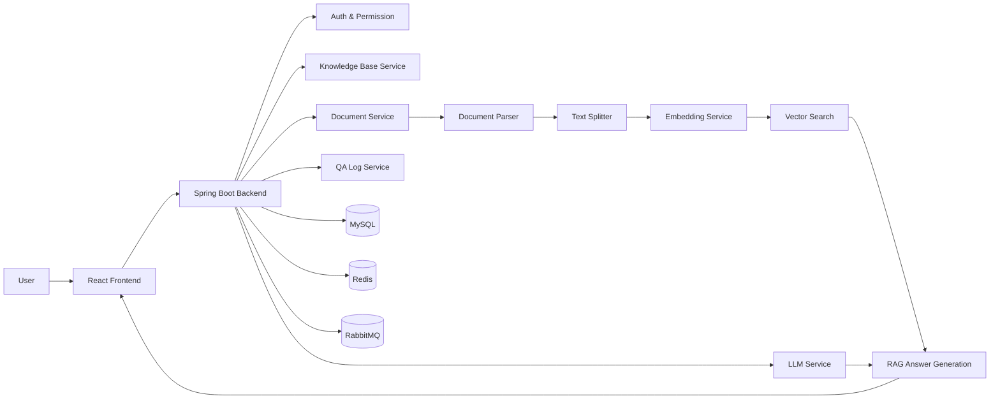

<p align="center">
  <h1 align="center">✨ AI Knowledge Base QA Platform ✨</h1>
  <p align="center">AI Knowledge Base QA Platform — RAG-Powered Enterprise Smart Q&A System</p>
</p>

<p align="center">
  
  
  
  
  
  
  
  
  
  
</p>

<p align="center">
  <a href="README.md">简体中文</a> | <a href="README.en.md"><b>English</b></a>
</p>

---

## Project Overview

Enterprise internal knowledge is often scattered across documents, wikis, specification manuals, and other sources. Employees typically have to sift through large amounts of material to find the information they need — a process that is time-consuming and prone to inconsistencies.

**AI Knowledge Base QA Platform** is an enterprise knowledge base Q&A system built on **RAG (Retrieval-Augmented Generation)**. It provides a complete pipeline from knowledge base management, document upload and parsing, text chunking and vectorization, to semantic retrieval and LLM-powered answer generation. Users can ask questions in natural language, and the system retrieves the most relevant content from the knowledge base to generate accurate answers with cited sources.

Core objective: **Unified enterprise knowledge ingestion → intelligent retrieval → precise answer generation**, improving knowledge acquisition efficiency, reducing repetitive consultation costs, and ensuring consistent answers.

---

## 📸 Screenshots

### Login

<p align="center">
  
</p>

### Knowledge Base List

<p align="center">
  
</p>

### Document Management

<p align="center">
  
</p>

### Chat

<p align="center">
  
</p>

---

## Features

- 🚀 **End-to-end RAG Q&A pipeline** — From document parsing to answer generation, a complete closed loop
- 📚 **Knowledge base management** — Create, rename, and delete knowledge bases
- 📄 **Document processing** — Upload, parse, chunk, and manage processing status across the full workflow
- 🧠 **Embedding vectorization** — Text chunks are vectorized for semantic retrieval
- 💬 **Smart Q&A** — Ask questions in natural language, get answers grounded in knowledge base content
- 🔎 **Answer traceability** — View cited sources and retrieved snippets for verifiable answers
- 🧾 **Q&A logs** — Conversation history recording and review
- 🛡️ **Basic permission control** — Login authentication and admin backend
- 🚫 **Refusal strategy** — Unified handling when retrieval yields no relevant results
- 🔐 **Sensitive information protection** — Log desensitization
- 📱 **Responsive layout** — Basic mobile adaptation for the frontend
- ⚙️ **OpenAI API compatibility** — Support for third-party OpenAI-compatible LLM / Embedding APIs
- 🐳 **Docker Compose** — One-click startup for MySQL, Redis, and RabbitMQ
- 🗃️ **Flyway auto migration** — Database schema management without manual SQL execution

---

## Tech Stack

### Backend

| Technology | Purpose |
|---|---|
| Spring Boot 3.5 | Application framework |
| Spring Security | Authentication and authorization |
| MyBatis-Plus | ORM framework |
| MySQL 8 | Relational database |
| Redis 7 | Caching |
| RabbitMQ 3-management | Message queue (async document processing) |
| Flyway | Database version migration |
| JWT (jjwt) | Token authentication |
| SpringDoc / Swagger | API documentation |
| PDFBox & Apache POI | PDF / DOCX document parsing |
| Maven | Build tool |

### Frontend

| Technology | Purpose |
|---|---|
| React 19 | UI framework |
| TypeScript 5.9 | Type safety |
| Vite 8 | Build tool and dev server |
| Tailwind CSS 4 | Styling framework |
| React Router 7 | Routing |
| Axios | HTTP client |

### AI / RAG

| Technology | Purpose |
|---|---|
| LLM API | Answer generation (OpenAI-compatible) |
| Embedding API | Text vectorization (OpenAI-compatible) |
| Vector Search | Semantic retrieval |
| Text Splitter | Document text chunking |
| Prompt Strategy | Prompt engineering |
| RAG Pipeline | Retrieval-Augmented Generation workflow |

### DevOps / Tooling

- **Docker Compose** — One-click middleware deployment
- **Git** — Version control
- **Apifox** — API testing
- **.env** Configuration management

---

## Architecture



**Pipeline description:**

1. User uploads a document → Document parser extracts text → Text splitter creates chunks
2. Chunks are sent asynchronously via message queue → Embedding service vectorizes them → Stored in vector index
3. User asks a question → Most relevant chunks are retrieved → LLM generates an answer with context → Retrieved snippets and citations are returned

---

## Quick Start

### 1. Clone the project

```bash
git clone https://github.com/your-username/AI-knowledge-base-QA-platform.git
cd AI-knowledge-base-QA-platform
```

### 2. Configure environment variables

```bash
cp .env.example .env
```

Open `.env` and configure the following **AI-related environment variables** (at minimum, the complete LLM and Embedding configuration is required):

```
# ---- LLM Configuration ----
APP_LLM_BASE_URL=https://api.example.com/v1/messages
APP_LLM_API_KEY=your_llm_api_key_here
APP_LLM_MODEL=your-chat-model

# ---- Embedding Configuration ----
APP_EMBEDDING_BASE_URL=https://api.example.com/v1/embeddings
APP_EMBEDDING_API_KEY=your_embedding_api_key_here
APP_EMBEDDING_MODEL=text-embedding-3-large
APP_EMBEDDING_VECTOR_SIZE=3072
```

> ⚠️ Without valid LLM / Embedding configuration, the basic pages will load, but **document vectorization and RAG Q&A will not work**.

### 3. Start middleware (MySQL + Redis + RabbitMQ)

```bash
docker compose up -d
```

This starts the following services:

| Service | Port | Address |
|---|---|---|
| MySQL 8 | 3306 | localhost:3306 |
| Redis 7 | 6379 | localhost:6379 |
| RabbitMQ 3-management | 5672 / 15672 | localhost:5672 / http://localhost:15672 |

> Default RabbitMQ credentials: `guest` / `guest`.

### 4. Start backend

**Windows:**

```bat
start-backend.bat
```

**macOS / Linux:**

```bash
chmod +x start-backend.sh
./start-backend.sh
```

Backend default address: **http://localhost:8080**

> The project activates the `dev` profile by default (controlled by `SPRING_PROFILES_ACTIVE=dev` in `.env`).
>
> 🗃️ **Flyway** automatically runs database migrations when the backend starts — **no manual SQL import is needed**.

### 5. Start frontend

**Windows:**

```bat
start-frontend.bat
```

**macOS / Linux:**

```bash
chmod +x start-frontend.sh
./start-frontend.sh
```

The frontend script automatically detects `pnpm` / `yarn` / `npm`, installs dependencies, and starts the dev server.

Frontend default address: **http://localhost:5173**

### 6. Open browser

```
http://localhost:5173
```

---

## Usage Flow

After startup, follow this complete workflow:

```text
Register an account → Log in → Create a knowledge base → Upload documents
→ Parse documents (automatic) → Run vectorization (automatic) → Open Q&A page
→ Ask a question → View the AI-generated answer → Check source citations and retrieved snippets
```

1. **Register an account** — Open the homepage, click register, enter username and password
2. **Log in** — Log in with your registered credentials
3. **Create a knowledge base** — Create a new knowledge base on the knowledge base page
4. **Upload documents** — Enter the knowledge base and upload text files (TXT, PDF, DOCX supported)
5. **Parse documents** — The system automatically parses documents and generates text chunks
6. **Run vectorization** — Chunks automatically enter the embedding pipeline for vectorization
7. **Open Q&A** — Switch to the Q&A page and select the target knowledge base
8. **Ask a question** — Enter a natural language question related to the document content
9. **View the answer** — See the AI-generated answer based on the knowledge base
10. **Check citations** — View the original text snippets and source documents cited in the answer

---

## Project Structure

```text
AI-knowledge-base-QA-platform/
├── backend/                      # Spring Boot backend
│   ├── src/
│   │   ├── main/
│   │   │   ├── java/com/example/aikb/
│   │   │   │   ├── common/           # Common utilities
│   │   │   │   ├── config/           # Configuration classes
│   │   │   │   ├── controller/       # API controllers
│   │   │   │   ├── dto/              # Data transfer objects
│   │   │   │   ├── entity/           # Data entities
│   │   │   │   ├── mapper/           # MyBatis mappers
│   │   │   │   ├── mq/               # Message queue
│   │   │   │   ├── security/         # Security and authentication
│   │   │   │   ├── service/          # Business logic
│   │   │   │   └── vo/               # View objects
│   │   │   └── resources/
│   │   │       ├── db/migration/     # Flyway migration scripts
│   │   │       ├── application.yml   # Main configuration
│   │   │       └── application-dev.yml
│   │   └── test/
│   ├── pom.xml
│   └── ...

├── frontend/                     # React + TypeScript frontend
│   ├── src/
│   │   ├── api/                  # API request layer
│   │   ├── components/           # Common components
│   │   ├── context/              # Global state
│   │   ├── pages/                # Page components
│   │   ├── router/               # Route configuration
│   │   ├── types/                # Type definitions
│   │   └── utils/                # Utility functions
│   ├── package.json
│   └── vite.config.ts

├── docs/                         # Project docs and screenshots
├── docker-compose.yml            # Middleware Docker orchestration
├── .env.example                  # Environment variable template
├── start-backend.bat             # Windows backend startup script
├── start-backend.sh              # Unix backend startup script
├── start-frontend.bat            # Windows frontend startup script
├── start-frontend.sh             # Unix frontend startup script
├── README.md
├── README.en.md
└── .gitignore
```

---

## Build

### Backend build

```bash
cd backend
mvn clean package -DskipTests
```

### Frontend build

```bash
cd frontend
npm run build
```

> Full Docker deployment (frontend + backend + middleware all containerized) is planned for a future release.

---

## FAQ

### 1. Why does AI Q&A not work after startup?

You need to configure valid **LLM API Key** and **Embedding API Key** in `.env`. This project does not include AI models — you must integrate with a third-party LLM / Embedding API that is compatible with the OpenAI format.

### 2. Why is manual SQL import not required?

The project uses **Flyway** for database migration. When the backend starts, it automatically detects and applies all pending migration scripts, initializing the database schema without any manual intervention.

### 3. What does `docker compose up -d` start?

**Only the middleware services:** MySQL 8, Redis 7, and RabbitMQ 3-management. The frontend and backend are still started locally via `start-backend` / `start-frontend` scripts.

### 4. Where is the RabbitMQ management UI?

Default address: **http://localhost:15672**. Default username and password are both `guest`.

### 5. What should I do if a port is already in use?

You can modify the `DB_PORT`, `REDIS_PORT`, `RABBITMQ_PORT` and other variables in `.env`. The `docker-compose.yml` file reads these values automatically.

---

## Roadmap

- [ ] **Multi-knowledge-base routing** — Automatically route questions to the most relevant knowledge base
- [ ] **Fine-grained permission control** — Per-knowledge-base read/write access management
- [ ] **Document version management** — Document update history and version comparison
- [ ] **Knowledge quality scoring** — Automatic quality assessment of knowledge base content
- [ ] **Enhanced multi-format parsing** — Improved PDF, Word, and Excel parsing
- [ ] **Q&A feedback loop** — User feedback to drive knowledge base optimization
- [ ] **Admin analytics dashboard** — Operational data including Q&A volume, hit rate, and popular questions
- [ ] **Full Docker deployment** — Fully containerized frontend + backend + middleware deployment
- [ ] **Online demo environment** — A trial demo site for hands-on experience
- [ ] **CI/CD automation** — Continuous integration and automated deployment pipeline

---

## License

This project is for learning and portfolio demonstration purposes. Please add a LICENSE file before public distribution.
