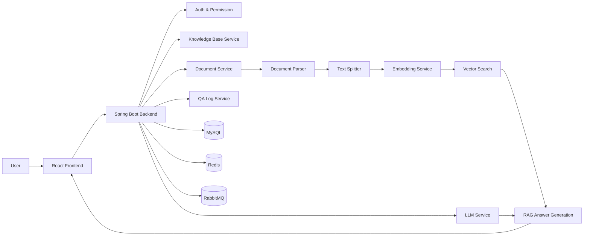

<p align="center">
  <h1 align="center">✨ AI Knowledge Base QA Platform ✨</h1>
  <p align="center">AI 知识库问答平台 —— 基于 RAG 的企业级智能问答系统</p>
</p>

<p align="center">
  
  
  
  
  
  
  
  
  
  
</p>

<p align="center">
  <a href="#"><b>简体中文</b></a> | <a href="#">English</a>
</p>

---

## 项目简介

企业内部知识通常分散在文档、Wiki、规范手册等不同载体中，员工查询信息往往需要翻阅大量资料，效率低下且口径不一。

**AI Knowledge Base QA Platform** 是一个基于 **RAG（Retrieval-Augmented Generation）** 的企业知识库问答平台。它提供从知识库管理、文档上传与解析、文本切片与向量化，到语义检索和 LLM 问答生成的完整流程。用户可以用自然语言提问，系统从知识库中检索最相关的内容，生成带有引用来源的准确回答。

核心目标：**统一接入企业知识 → 智能检索 → 精准问答生成**，提升知识获取效率，降低重复咨询成本，保证回答口径一致。

---

## 📸 Screenshots

### 登录页面

<p align="center">
  
</p>

### 知识库列表

<p align="center">
  
</p>

### 文档管理

<p align="center">
  
</p>

### 问答对话

<p align="center">
  
</p>

---

## ✨ Features

- 🚀 **完整 RAG 问答流程** — 从文档解析到答案生成，端到端闭环
- 📚 **知识库管理** — 创建、重命名、删除知识库
- 📄 **文档处理** — 上传、解析、切片、处理状态全流程管理
- 🧠 **Embedding 向量化** — 文本切片后向量化存储，支持语义检索
- 💬 **智能问答** — 自然语言提问，基于知识库内容生成回答
- 🔎 **答案溯源** — 展示引用来源与检索片段，回答有据可查
- 🧾 **问答日志** — 记录对话历史，支持回溯查看
- 🛡️ **基础权限控制** — 登录认证、管理员后台
- 🚫 **拒答策略** — 检索未命中时的统一拒答处理
- 🔐 **敏感信息保护** — 日志脱敏处理
- 📱 **响应式适配** — 前端基础移动端适配
- ⚙️ **兼容 OpenAI API** — 支持第三方 OpenAI 格式的 LLM / Embedding API
- 🐳 **Docker Compose** — 一键启动 MySQL、Redis、RabbitMQ
- 🗃️ **Flyway 自动迁移** — 数据库 Schema 自动管理，无需手动执行 SQL

---

## 🛠️ Tech Stack

### Backend

| Technology | Purpose |
|---|---|
| Spring Boot 3.5 | 应用框架 |
| Spring Security | 认证与授权 |
| MyBatis-Plus | ORM 框架 |
| MySQL 8 | 关系型数据库 |
| Redis 7 | 缓存 |
| RabbitMQ 3-management | 消息队列（异步文档处理） |
| Flyway | 数据库版本迁移 |
| JWT (jjwt) | 令牌认证 |
| SpringDoc / Swagger | API 文档 |
| PDFBox & Apache POI | PDF / DOCX 文档解析 |
| Maven | 构建工具 |

### Frontend

| Technology | Purpose |
|---|---|
| React 19 | UI 框架 |
| TypeScript 5.9 | 类型安全 |
| Vite 8 | 构建工具与开发服务器 |
| Tailwind CSS 4 | 样式框架 |
| React Router 7 | 路由 |
| Axios | HTTP 请求 |

### AI / RAG

| Technology | Purpose |
|---|---|
| LLM API | 问答生成（兼容 OpenAI 格式） |
| Embedding API | 文本向量化（兼容 OpenAI 格式） |
| Vector Search | 语义检索 |
| Text Splitter | 文档文本切片 |
| Prompt Strategy | 提示词策略 |
| RAG Pipeline | 检索增强生成流程 |

### DevOps / Tooling

- **Docker Compose** — 中间件一键部署
- **Git** — 版本控制
- **Apifox** — API 调试
- **.env** 配置管理

---

## 🧩 Architecture



**流程说明：**

1. 用户上传文档 → 文档解析器提取文本 → 文本切片器分块
2. 切片通过消息队列异步发送 → Embedding 服务向量化 → 存入向量索引
3. 用户提问 → 检索最相关切片 → LLM 根据上下文生成回答 → 返回引用来源

---

## 🚀 Quick Start

### 1. Clone 项目

```bash
git clone https://github.com/your-username/AI-knowledge-base-QA-platform.git
cd AI-knowledge-base-QA-platform
```

### 2. 配置环境变量

```bash
cp .env.example .env
```

打开 `.env`，配置 **LLM API Key** 和 **Embedding API Key**：

```
APP_LLM_API_KEY=your_llm_api_key_here
APP_EMBEDDING_API_KEY=your_embedding_api_key_here
```

> ⚠️ 如果不配置 LLM / Embedding API Key，系统基础页面可以启动，但**文档向量化、RAG 问答等 AI 能力无法正常使用**。

### 3. 启动中间件（MySQL + Redis + RabbitMQ）

```bash
docker compose up -d
```

此命令会启动以下服务：

| Service | Port | 访问地址 |
|---|---|---|
| MySQL 8 | 3306 | localhost:3306 |
| Redis 7 | 6379 | localhost:6379 |
| RabbitMQ 3-management | 5672 / 15672 | localhost:5672 / http://localhost:15672 |

> RabbitMQ 默认账号密码：`guest` / `guest`。

### 4. 启动后端

**Windows：**

```bat
start-backend.bat
```

**macOS / Linux：**

```bash
chmod +x start-backend.sh
./start-backend.sh
```

后端默认地址：**http://localhost:8080**

> 项目默认激活 `dev` Profile（通过 `.env` 中 `SPRING_PROFILES_ACTIVE=dev` 控制）。
>
> 🗃️ **Flyway** 会在后端启动时自动执行数据库迁移，**无需手动导入 SQL**。

### 5. 启动前端

**Windows：**

```bat
start-frontend.bat
```

**macOS / Linux：**

```bash
chmod +x start-frontend.sh
./start-frontend.sh
```

前端脚本会自动检测 `pnpm` / `yarn` / `npm`，安装依赖并启动开发服务器。

前端默认地址：**http://localhost:5173**

### 6. 打开浏览器

```
http://localhost:5173
```

---

## 📌 Usage Flow

完成启动后，按以下流程完整体验：

```text
注册账号 → 登录系统 → 创建知识库 → 上传文档
→ 解析文档（自动） → 执行向量化（自动） → 进入问答页面
→ 输入问题 → 查看 AI 回答 → 查看引用来源与检索片段
```

1. **注册账号** — 打开首页，点击注册，填写用户名和密码
2. **登录系统** — 使用注册的账号登录
3. **创建知识库** — 在知识库页面创建一个新的知识库
4. **上传文档** — 进入知识库，上传文本文件（支持 TXT、PDF、DOCX）
5. **解析文档** — 系统自动解析文档并生成文本切片
6. **执行向量化** — 切片自动进入 Embedding 管道完成向量化
7. **进入问答** — 切换到问答页面，选择目标知识库
8. **输入问题** — 输入与文档内容相关的自然语言问题
9. **查看回答** — 查看 AI 基于知识库生成的回答
10. **查看引用** — 查看回答中引用的原文片段和来源文档

---

## 📁 Project Structure

```text
AI-knowledge-base-QA-platform/
├── backend/                      # Spring Boot backend
│   ├── src/
│   │   ├── main/
│   │   │   ├── java/com/example/aikb/
│   │   │   │   ├── common/           # 通用工具
│   │   │   │   ├── config/           # 配置类
│   │   │   │   ├── controller/       # API 控制器
│   │   │   │   ├── dto/              # 数据传输对象
│   │   │   │   ├── entity/           # 数据实体
│   │   │   │   ├── mapper/           # MyBatis Mapper
│   │   │   │   ├── mq/               # 消息队列
│   │   │   │   ├── security/         # 安全认证
│   │   │   │   ├── service/          # 业务逻辑
│   │   │   │   └── vo/               # 视图对象
│   │   │   └── resources/
│   │   │       ├── db/migration/     # Flyway 迁移脚本
│   │   │       ├── application.yml   # 主配置
│   │   │       └── application-dev.yml
│   │   └── test/
│   ├── pom.xml
│   └── ...
│
├── frontend/                     # React + TypeScript frontend
│   ├── src/
│   │   ├── api/                  # API 请求层
│   │   ├── components/           # 通用组件
│   │   ├── context/              # 全局状态
│   │   ├── pages/                # 页面组件
│   │   ├── router/               # 路由配置
│   │   ├── types/                # 类型定义
│   │   └── utils/                # 工具函数
│   ├── package.json
│   └── vite.config.ts
│
├── docs/                         # 项目文档与截图
├── docker-compose.yml            # 中间件 Docker 编排
├── .env.example                  # 环境变量模板
├── start-backend.bat             # Windows 后端启动脚本
├── start-backend.sh              # Unix 后端启动脚本
├── start-frontend.bat            # Windows 前端启动脚本
├── start-frontend.sh             # Unix 前端启动脚本
├── README.md
└── .gitignore
```

---

## 📦 Build

### 后端构建

```bash
cd backend
mvn clean package -DskipTests
```

### 前端构建

```bash
cd frontend
npm run build
```

> Docker 完整应用部署（前后端 + 中间件全容器化）计划在后续版本中实现。

---

## ❓ FAQ

### 1. 为什么启动后不能进行 AI 问答？

因为需要在 `.env` 中配置有效的 **LLM API Key** 和 **Embedding API Key**。项目本身不提供 AI 模型，需要接入第三方 LLM / Embedding API（兼容 OpenAI 格式）。

### 2. 为什么不需要手动导入 SQL？

项目使用 **Flyway** 管理数据库迁移，后端启动时会自动检测并执行所有未应用的迁移脚本，自动完成数据库结构初始化。

### 3. `docker compose up -d` 启动了什么？

**只启动了中间件：** MySQL 8、Redis 7、RabbitMQ 3-management。前端和后端仍然在本地运行（通过 `start-backend` / `start-frontend` 脚本启动）。

### 4. RabbitMQ 管理后台在哪里？

默认地址：**http://localhost:15672**，默认账号密码均为 `guest`。

### 5. 端口冲突怎么办？

可以在 `.env` 中修改 `DB_PORT`、`REDIS_PORT`、`RABBITMQ_PORT` 等变量，`docker-compose.yml` 会自动读取覆盖。

---

## 🧭 Roadmap

- [ ] **多知识库路由** — 根据问题自动路由到最匹配的知识库
- [ ] **细粒度权限控制** — 知识库级别的读写权限管理
- [ ] **文档版本管理** — 文档更新历史与版本对比
- [ ] **知识质量评分** — 自动评估知识库内容质量
- [ ] **多格式解析增强** — 更完善的 PDF、Word、Excel 解析
- [ ] **问答反馈闭环** — 用户反馈驱动知识库优化
- [ ] **数据统计面板** — 问答量、命中率、热门问题等运营数据
- [ ] **Docker 完整部署** — 前后端 + 中间件全容器化部署
- [ ] **在线演示环境** — 可直接体验的 Demo 站点
- [ ] **CI/CD 自动化** — 持续集成与自动部署流水线

---

## 📄 License

This project is for learning and portfolio demonstration purposes. Please add a LICENSE file before public distribution.
